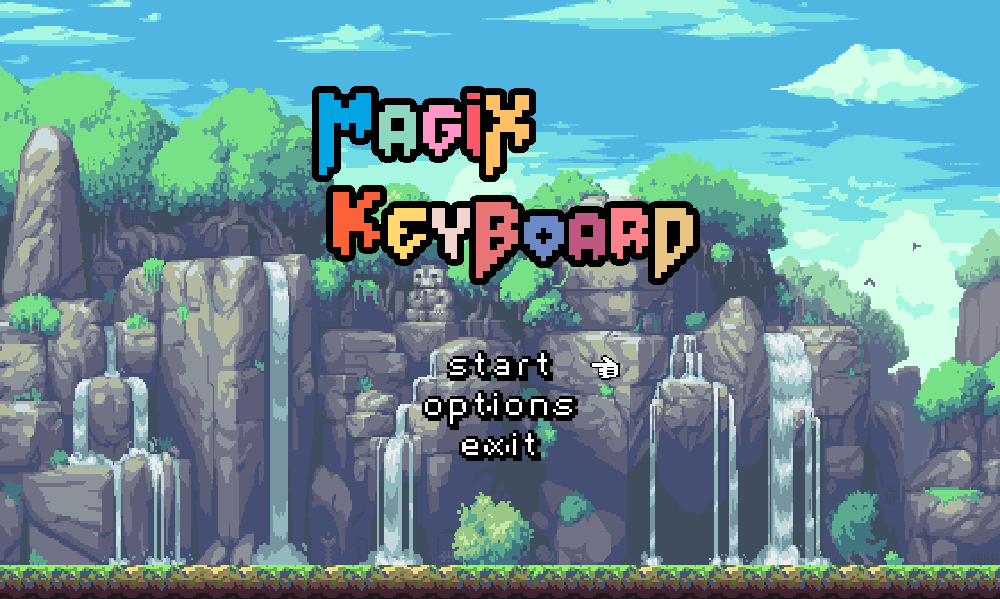

# INT2215 - Typing game

This repository contains a simple typing game built on the low-level C++ graphics library SDL2.

## Dependencies

The game depends on `SDL2`, `SDL2_image`, and `SDL_ttf` for the low-level graphics manipulating and rendering and `GCC` compiler since the library is built on `C++`. 
The current version is tested on the lastest version of the library and `C++14`, no upgrade to the dependencies should be made for simplicity and stability.

## Installation on Windows
- Install [GCC](https://sourceforge.net/projects/mingw/)
- Install [SDL2](https://www.libsdl.org/download-2.0.php), [SDL2_image](https://www.libsdl.org/projects/SDL_image/), and [SDL_ttf](https://www.libsdl.org/projects/SDL_ttf/)
- Place the dependencies in the search directory of the project

## Build and run 
- Build: `g++ -std=c++14 -lmingw32 -lSDL2main -lSDL2 -lSDL2_image -lSDL2_ttf main.cpp`
- Run: `main.exe`
